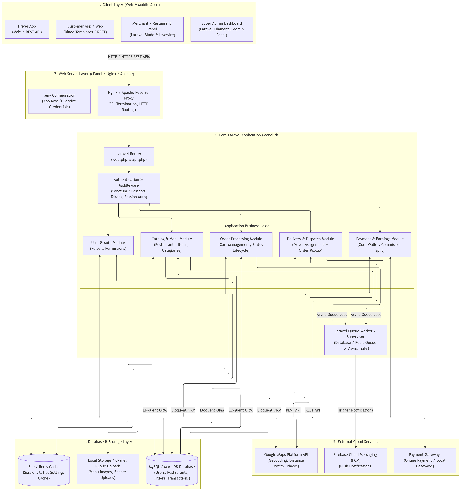
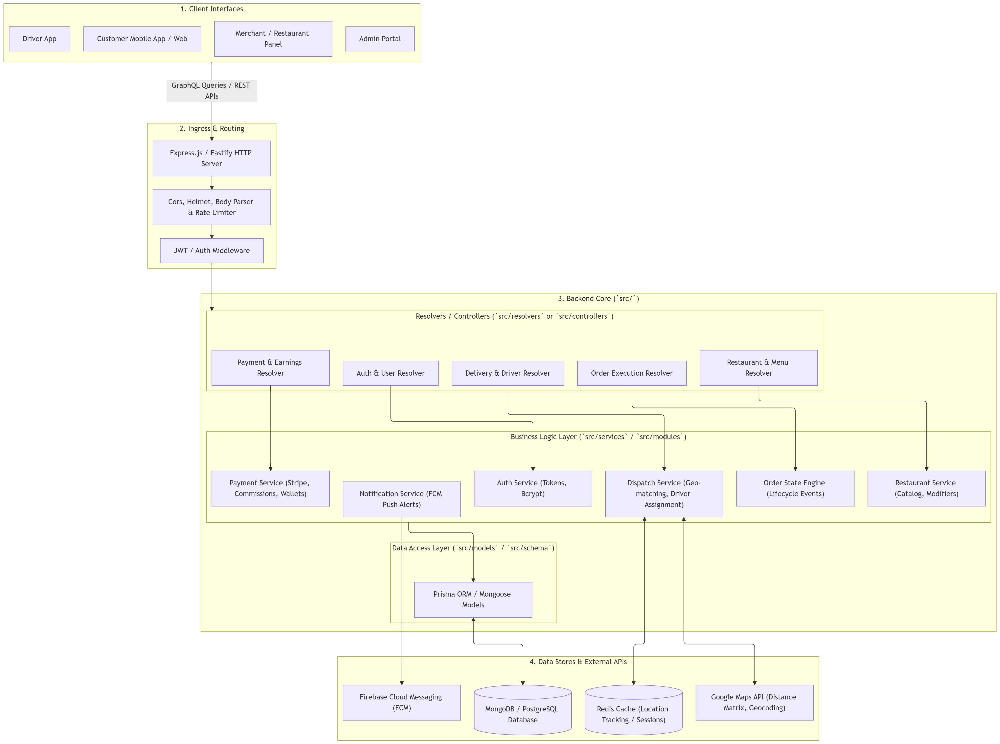
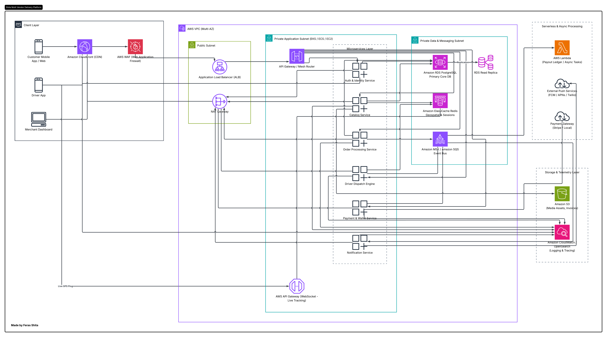
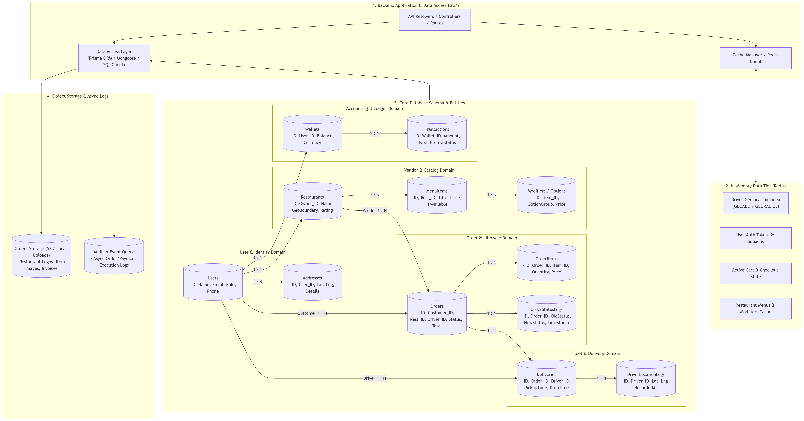
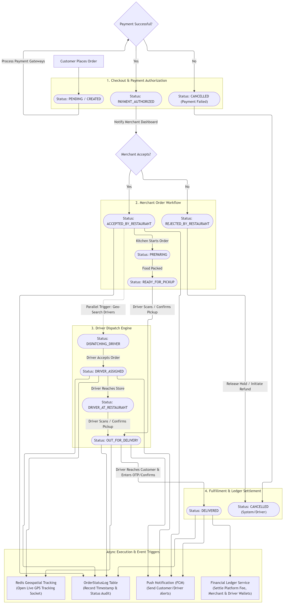

# Shita Multi-Vendor Food Delivery Platform
## System Architecture Documentation

---

# 1. System Overview

## 1.1 What Shita Does

Shita multi-vendor food delivery platform designed to connect customers, restaurants, and delivery riders through a single system.
The platform supports the complete food delivery lifecycle, from browsing restaurants and placing orders to restaurant processing, rider assignment, real-time delivery tracking, and order completion.
The system also provides administration tools for managing the platform, users, restaurants, orders, riders, and platform operations.

## 1.2 Main Users

### Customers

- Browse restaurants
- Browse menus
- Place orders
- Make payments
- Track deliveries
- Communicate with vendors and riders
- Manage their profile

### Vendors

- Manage restaurant information
- Manage menus
- Manage products
- Receive orders
- Process orders
- Update order status
- Monitor restaurant operations

### Delivery Riders

- Receive delivery requests
- Accept deliveries
- View delivery information
- Navigate to locations
- Update delivery status
- Share location
- Complete deliveries

### Administrators

- Manage users
- Manage vendors
- Manage riders
- Monitor orders
- Manage platform operations
- View analytics

## 1.3 Main Applications

Describe each application and its responsibility.

| Application | Technology | Main Responsibility |
|---|---|---|
| Customer Mobile App | React Native | Customer ordering |
| Vendor App | React Native | Restaurant management |
| Rider App | React Native | Delivery management |
| Customer Web App | Next.js | Web ordering |
| Admin Dashboard | React / Next.js | Platform administration |
| Backend | Node.js / Express | Business logic and API |
| Database | MongoDB | Persistent data storage |

# 1 High-Level Architecture

# 2 Architecture Diagram

# 3 Backend Diagram

# 4 AWS Cloud Diagram

# 5 Data Flow Diagram

# 6 Order Life Cycle Diagram

